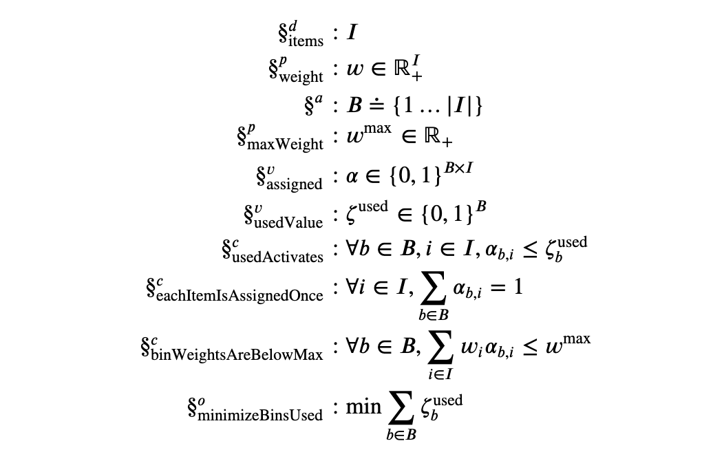

# Opvious Python SDK  [](https://github.com/opvious/sdk.py/actions/workflows/ci.yml) [](https://pypi.python.org/pypi/opvious/)

An SDK for solving linear, mixed-integer, and quadratic optimization models via
the [Opvious](https://www.opvious.io) API.

## Highlights

### Declarative modeling API

+ Extensive static validations
+ Exportable to LaTeX
+ Extensible support for high-level patterns (activation variables, masks, ...)

```python
import opvious.modeling as om

class BinPacking(om.Model):
  items = om.Dimension()  # All items to bin
  weight = om.Parameter.non_negative(items)  # Weight per item
  bins = om.interval(1, om.size(items), name="B")  # Available bins
  max_weight = om.Parameter.non_negative()  # Maximum weight for each bin
  assigned = om.Variable.indicator(bins, items)  # Bin to item assignment
  used = om.fragments.ActivationVariable(assigned, projection=1)  # 1 if a bin is used

  @om.constraint
  def each_item_is_assigned_once(self):
    for i in self.items:
      yield om.total(self.assigned(b, i) for b in self.bins) == 1

  @om.constraint
  def bin_weights_are_below_max(self):
    for b in self.bins:
      bin_weight = om.total(self.weight(i) * self.assigned(b, i) for i in self.items)
      yield bin_weight <= self.max_weight()

  @om.objective
  def minimize_bins_used(self):
    return self.used.total()
```

Auto-generated specification:

<p align="center">
  
</p>


### Transparent remote solves

+ No local solver installation required
+ Real-time progress notifications
+ Seamless data import/export via native support for `pandas`
+ Flexible multi-objective support: weighted sums, epsilon constraints, ...
+ Built-in debugging capabilities: relaxations, fully annotated LP formatting,
  ...

```python
import opvious

client = opvious.Client.default()

solution = await client.solve(
  opvious.Problem(
    specification=BinPacking().specification(),
    parameters={
      "weight": {"a": 10.5, "b": 22, "c": 48},
      "binMaxWeight": 50,
    },
  ),
)
assignments = solution.outputs.variable("assigned") # Optimal values
```

Take a look at https://opvious.readthedocs.io for the full documentation or
[these notebooks][notebooks] to see the SDK in action.

[notebooks]: https://github.com/opvious/examples/tree/main/notebooks
